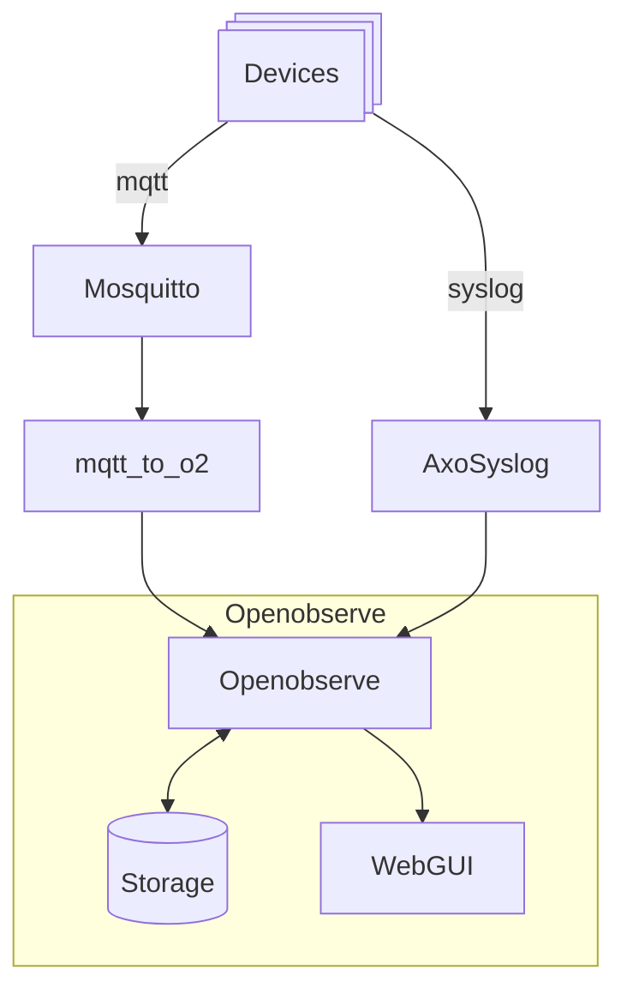

# datacollection

A bunch of scripts and configuration files to help collect data from a number of Axis devices. Data collected is:

- Syslog
- Event occurences published on mqtt
- (todo) Log of http requests

It uses these tools:

  - [Openobserve](https://openobserve.ai/)
  - [AxoSyslog](https://axoflow.com/docs/axosyslog-core/intro/)
  - [Mosquitto](https://mosquitto.org/)
  - Several Python scripts from this repo:
    - mqtt_to_02.py: listen to mqtt and push into Openobserve
    - setup_devices.py: configure mqtt connection on devices

The requirements that led to this choice were:

- Open source, free, self-managed versions of commercial solutions
- Deployable on both Linux and Windows (through WSL)
- Small footprint (small VM or bare metal)
- Act as remote syslog endpoint for Axis devices
- Allow sufficient options for data collection to help collect event conditions outside of syslog context
- Be able to query the data later, on criteria not yet known

The files provided here work for me. You will need to adapt IP addresses, pathnames, usernames and so on to your own situation.

## Overview
This diagram shows the flow of monitoring data:

<!-- # mqtt_to_02

Quick & dirty, ChatGPT assisted, script to subscribe to "axis/+/event/tns:onvif/#" and push into Openobserve metrics endpoint -->

## Getting started
The easiest start is to clone this repo in a user root folder, e.g. `/home/erik` so that you end up with `/home/erik/datacollection`. 
This isn't mandatory, just less paths to change to make things work. Read the various `README.md` files to get started with each of the tools. 
The file `settings.env` and the individual service files need to be adapted to the local situation. 

```sh
git clone https://github.com/janssen70/datacollection
cd datacollection
git submodule update --init --recursive
```

Preparations for systems not connected to internet can be found [here](./offline_install_guide.md)
